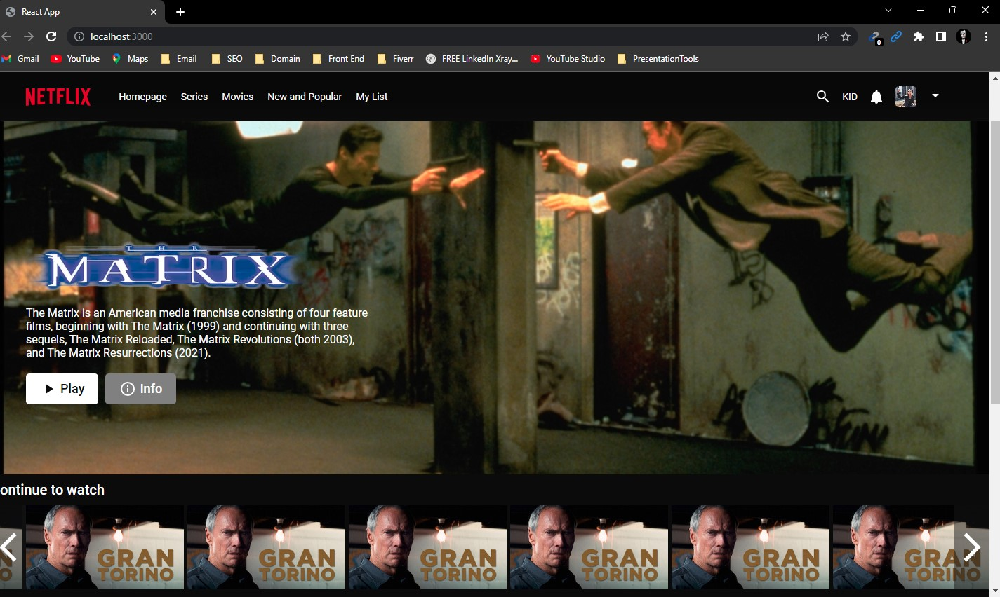
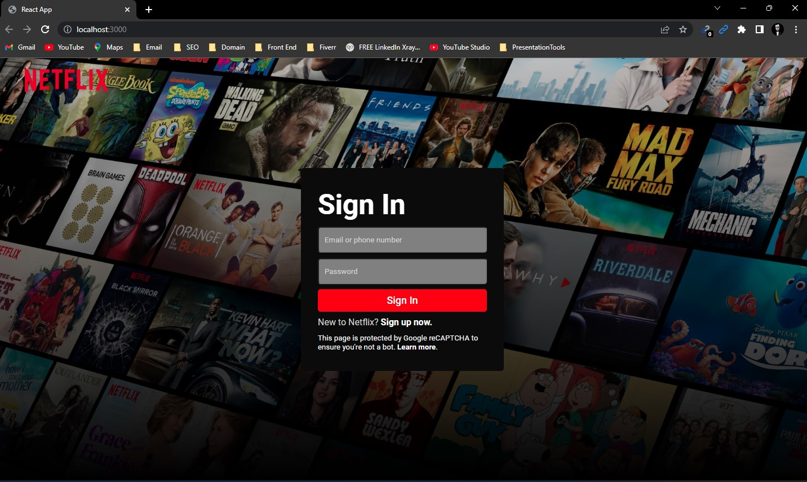
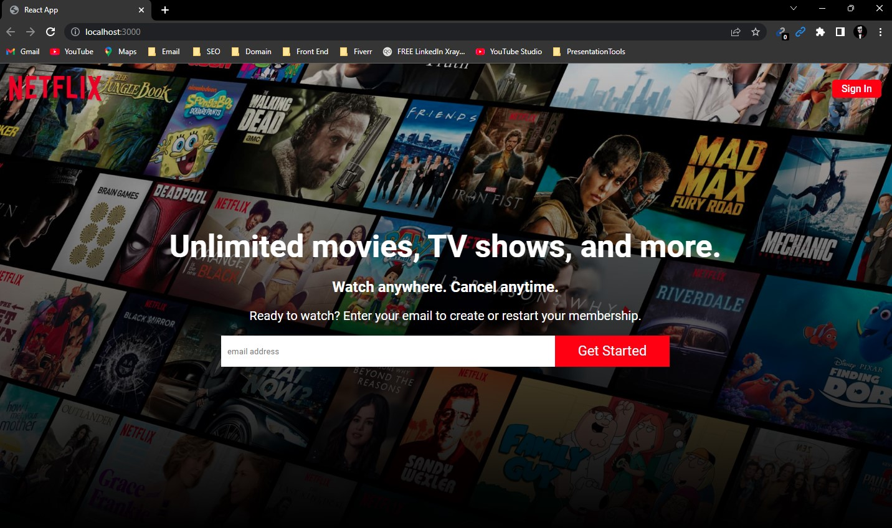
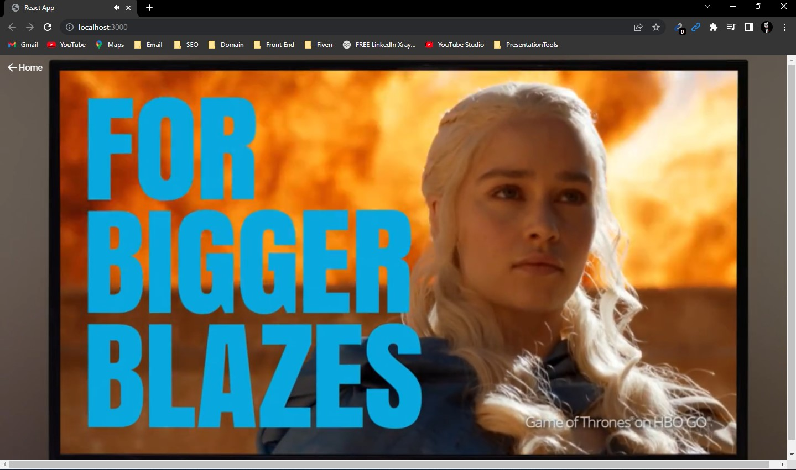

# Netflix Clone (Frontend)

This project is a simplified front end clone of Netflix. It was created with React and CSS (Grid and Flexbox).

## Homepage

## Login page

## Register page

## Watch 


### Tools used:
- Webpack
- Axios
- Redux & React
- Sass (grid & flexbox)

### User Stories:

- User can search for movies and TV shows on TMDb
- User can the see upcoming and trending movies. Data updates weekly
- User can click on a movie and a modal should pop up. It should display the title, release date, overview, and runtime.

## Installation
For production environments...

```sh
npm install
```
```sh
npm start
```
## _Contacts_
<a href="https://linkedin.com/in/sourovsarkerbd" target="blank"></a>
<a href="https://fb.com/sourov.saurabh.3" target="blank"></a>
<a href="https://instagram.com/sourovsaurabh" target="blank"></a>
<a href="https://auth.geeksforgeeks.org/user/sourovsarker" target="blank"></a>